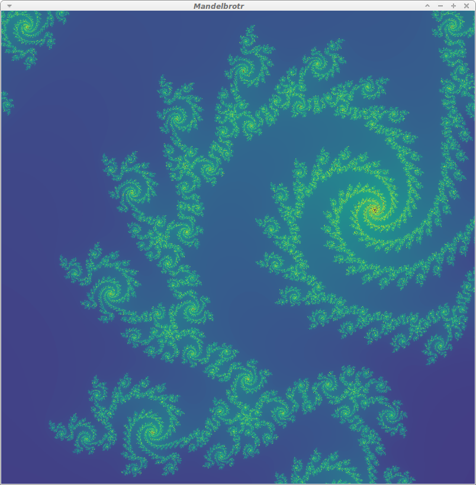

Mandelbrotr
-----------

A CUDA & OpenGL-powered Qt Mandelbrot pan/zoom application.  There are many like it, but this is mine.

Acknowledgements
----------------

* Qt+OpenGL starting point thanks to http://www.trentreed.net/blog/qt5-opengl-part-1-basic-rendering/ and articles that followed.
* Texturing from http://doc.qt.io/qt-5/qtopengl-textures-example.html
* CUDA+Qt
  * https://cudaspace.wordpress.com/2012/07/05/qt-creator-cuda-linux-review/
  * http://blog.qt.io/blog/2015/03/03/qt-weekly-28-qt-and-cuda-on-the-jetson-tk1/
  * https://www.nvidia.com/content/GTC/documents/1055_GTC09.pdf

License
-------

Since I cobbled together this code with the help of others, I'll be giving this back to the community.

  
   
  To the extent possible under law,
  <a rel="dct:publisher"
     href="https://github.com/rogerallen/mandelbrotr">
    Roger Allen</a>
  has waived all copyright and related or neighboring rights to
  Mandelbrotr.
This work is published from:

  United States.

